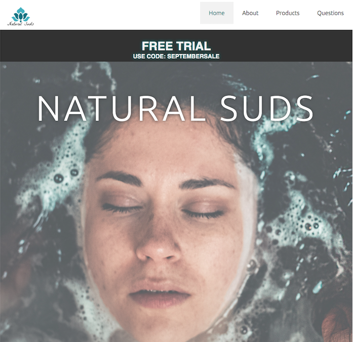
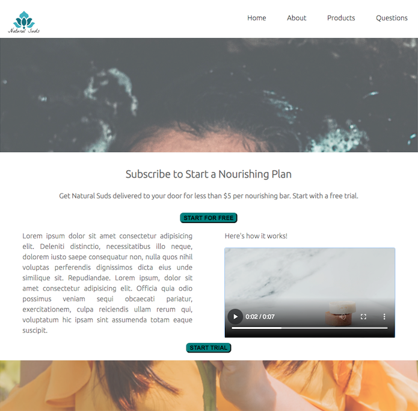
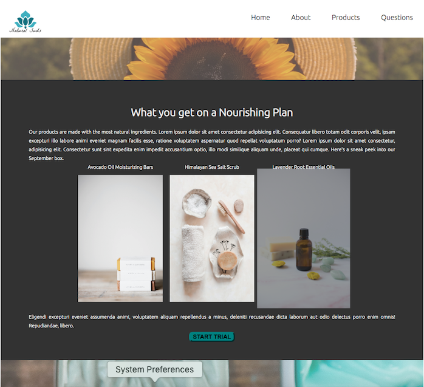
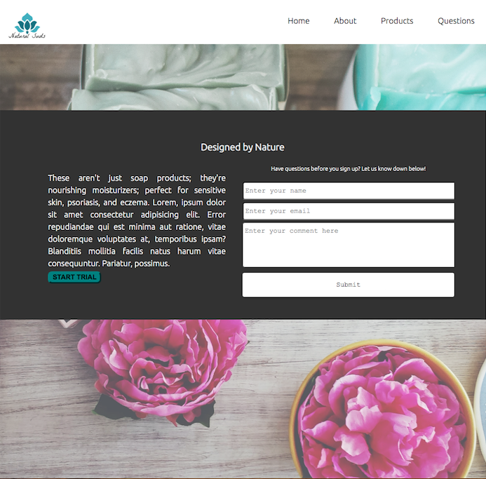

# Natural Suds Landing Page   

### Checkout the Live Version of the [Project](https://dcc5235.github.io/Soap_Landing/)!

**HTML5, CSS3**

A responsive, mobile first approach to a sample landing page for a moisturizer company. The site includes Flexbox designs, keyframes animation, parallax, and call to action features to advertise Natural Suds' monthly nourishing subscription.

---

## Project Highlights

Section | Features
------------ | -------------
[Header](#Header) | Responsive navigation bar with hover effect; Links navigate users to other elements of the page for further information. 
[Main: First Call to Action](#Main1) | Responsive text with columns that align with responsive call to action features and functioning video which users can control.
[Main: Second Call to Action](#Main2) | Flexbox design on images including hover effect to highlight individual images and call to action buttons.
[Main: Third Call to Action](#Main3) | Responsive text with form that allows users to submit information in the textbox area. 

## Header

## Main1

## Main2

## Main3

---

## Contributors

Dany Chheang dany.chheang@gmail.com
